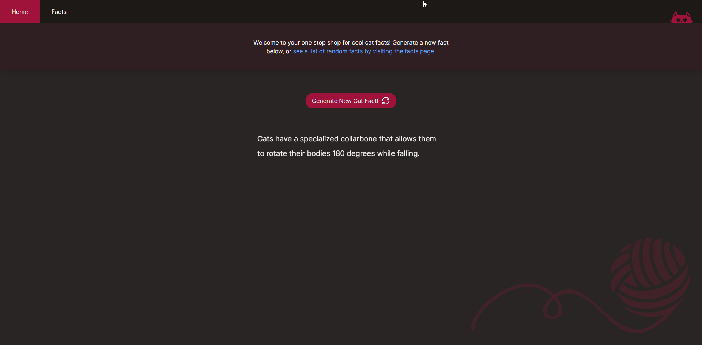
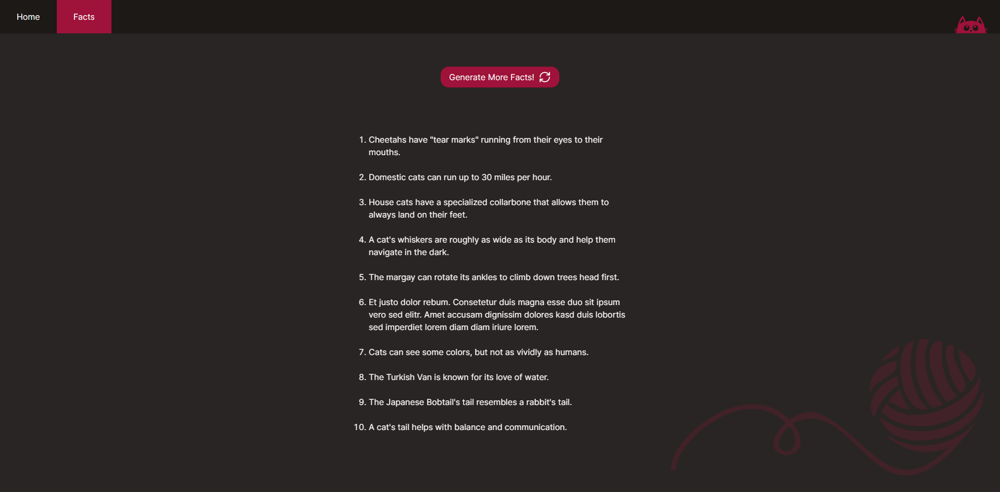

# Cat Facts Sample Application

Demonstrator application that displays random cat facts, built using Next.js. There are two pages; the homepage where you can generate individual facts and a bulk facts page where you can generate multiple facts at once. Click on a fact in the bulk facts page to visit that specific fact.

## Live Site
https://cat-facts-one.vercel.app/

## Features
- Generate random cat facts, bookmark your favorites
- Click a fact in the bulk facts page to visit that specific fact
- Responsive & accessible design, with support for reduced motion
- Animated navbar, facts, and buttons
- Internal route handlers for fact API

## Development

First, run the development server:

```bash
npm run dev
# or
yarn dev
# or
pnpm dev
# or
bun dev
```

## API Endpoints
- /api/v1/fact - returns a random cat fact
- /api/v1/fact?id=ID - returns a specific cat fact by ID
- /api/v1/facts - returns multiple cat facts
- /api/v1/facts?amount=amount - returns multiple cat facts with a set amount

### Example Response
The response will either be a single object or an array of objects, depending on the endpoint.
```
{
  "data": {
    "_id": 193,
    "text": "The Japanese Bobtail's tail resembles a rabbit's tail."
  }
}
```


## Images
Home Page:

Bulk Facts Page:
